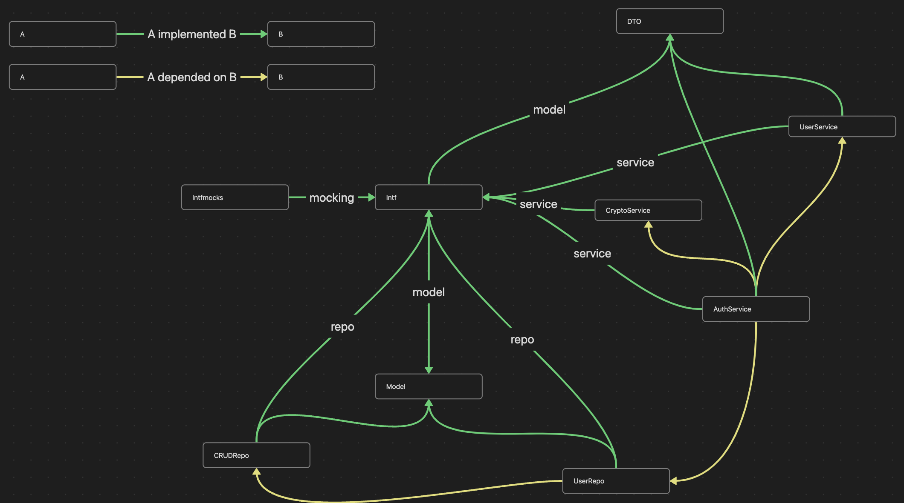

# Proj example pattern

## Idea

To prevent the duplication of code when using the go proverb `accept interfaces, returns struct`, we can define the global package named `intf`. It will contain the interfaces that our services will implement in development.

The `dto` package will contain the data transfer objects, holds all data that is required for the remote call.
The `model` package will contain the models, holds all data that is required for db operations.



Step: 

1. Define a interface for a service in the `intf` package.

```go
package intf

// CryptoService represents the interface of crypto service.
type CryptoService interface {
	// HashPassword returns hashed password with salt.
	HashPassword(password []byte) ([]byte, string, error)

	// ComparePassword returns true if the password is correct.
	ComparePassword(hashed []byte, salt []byte, password []byte) error

	// GenUlid generates an ulid that must be safe for concurrent use.
	GenUlid() string
}
```

2. Implement the interface in the `crypto` package.

```go
package crypto

import (
	"global-intf/internal/intf"
)

// Service represents the crypto service.
type Service struct {
}

// to check the 'Service' is missing methods from the 'intf.CryptoService' or not.
// the underscore here is not accessable at anywhere of current package.
// In this case, there will have errors here because the 'Service' is not fully
// implemented 'intf.CryptoService'.
var _ intf.CryptoService = &Service{}

// NewService creates a Service.
func NewService() *Service {
	return &Service{}
}
```

3. For any package that needs to use `CryptoService`, we can use `intf.CryptoService` instead of struct directly.

```go
package auth

import (
	"global-intf/internal/intf"
)

// Service represents the  service.
type Service struct {
	userRepo intf.UserRepo

	crypto intf.CryptoService
}

// to check the 'Service' is missing methods from the 'intf.AuthService' or not.
var _ intf.AuthService = &Service{}

// NewService creates a Service.
func NewService(userRepo intf.UserRepo, crypto intf.CryptoService) *Service {
	return &Service{
		userRepo: userRepo,
		crypto:   crypto,
	}
}
```

## Prequiresites

1. Mockery

## Testing

Before testing, we must prepair all the interfaces of `intf` package.
Because the services inside `internal` depended on this.

```bash
mockery --dir=internal/intf --output=internal/intfmocks --outpkg=intfmocks --all
```

To test a package, we can use the following command:

```bash
# example testing all *_test.go inside auth package.
go test ./internal/auth # use '-v' flag to verbose output
```
